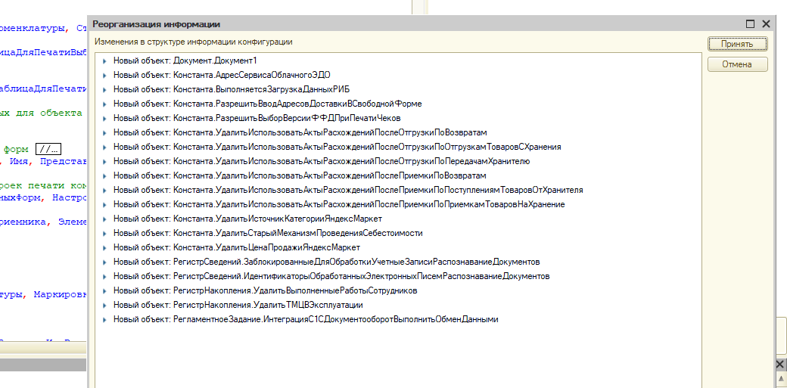

[view:hierarchy=none::::List]

0011-000275

\{ВнешняяОбработка.ОбменСНовойБазойXDTOЗагрузка.Форма.Форма.Форма(1188)}:	ЭтаОбработка.ВыполнитьКоманду(,,РежимОтладки, ФлагиПрогрузки);

по причине:

Запись не верна! Значение поля "Склад" не может быть пустым! (Регистр накопления: Товары к отгрузке; Номер строки: 1)

Невозможно провести документ Приобретение 0011-004909 от 17.10.2025 0:00:00

\{ВнешняяОбработка.ОбменСНовойБазойXDTOЗагрузка.МодульОбъекта(648)}: Ошибка при вызове метода контекста (Записать): Ошибка при выполнении обработчика - 'ПередЗаписью': \{РегистрСведений.АналитикаУчетаНоменклатуры.МодульМенеджера(448)}: Ошибка при получении набора регистра сведений АналитикаУчетаНоменклатуры: указана номенклатура с типом, отличным от "Услуга" или "Работа", а место хранения не заполнено.

Невозможно провести документ 0011-000275 от 24.01.2026 16:03:50

\{ВнешняяОбработка.ОбменСНовойБазойXDTOЗагрузка.МодульОбъекта(1714)}: Ошибка при вызове метода контекста (Записать): Ошибка при выполнении обработчика - 'ОбработкаПроведения': \{ОбщийМодуль.ПроведениеДокументов.Модуль(1875)}: Ошибка при вызове метода контекста (Записать): Запись не верна! Значение поля "Склад" не может быть пустым! (Регистр накопления: Товары к отгрузке; Номер строки: 1)

Невозможно провести документ 0011-000276 от 24.01.2026 16:05:35

\{ВнешняяОбработка.ОбменСНовойБазойXDTOЗагрузка.МодульОбъекта(1714)}: Ошибка при вызове метода контекста (Записать): Ошибка при выполнении обработчика - 'ОбработкаПроведения': \{ОбщийМодуль.ПроведениеДокументов.Модуль(1875)}: Ошибка при вызове метода контекста (Записать): Запись не верна! Значение поля "Склад" не может быть пустым! (Регистр накопления: Товары к отгрузке; Номер строки: 1)

Невозможно провести документ 0011-000277 от 24.01.2026 16:07:47

\{ВнешняяОбработка.ОбменСНовойБазойXDTOЗагрузка.МодульОбъекта(1714)}: Ошибка при вызове метода контекста (Записать): Ошибка при выполнении обработчика - 'ОбработкаПроведения': \{ОбщийМодуль.ПроведениеДокументов.Модуль(1875)}: Ошибка при вызове метода контекста (Записать): Запись не верна! Значение поля "Склад" не может быть пустым! (Регистр накопления: Товары к отгрузке; Номер строки: 1)

Невозможно провести документ 0011-000278 от 24.01.2026 16:09:25

\{ВнешняяОбработка.ОбменСНовойБазойXDTOЗагрузка.МодульОбъекта(1714)}: Ошибка при вызове метода контекста (Записать): Ошибка при выполнении обработчика - 'ОбработкаПроведения': \{ОбщийМодуль.ПроведениеДокументов.Модуль(1875)}: Ошибка при вызове метода контекста (Записать): Запись не верна! Значение поля "Склад" не может быть пустым! (Регистр накопления: Товары к отгрузке; Номер строки: 1)

Невозможно провести документ 0011-000279 от 24.01.2026 16:16:27

\{ВнешняяОбработка.ОбменСНовойБазойXDTOЗагрузка.МодульОбъекта(1714)}: Ошибка при вызове метода контекста (Записать): Ошибка при выполнении обработчика - 'ОбработкаПроведения': \{ОбщийМодуль.ПроведениеДокументов.Модуль(1875)}: Ошибка при вызове метода контекста (Записать): Запись не верна! Значение поля "Склад" не может быть пустым! (Регистр накопления: Товары к отгрузке; Номер строки: 1)

Невозможно провести документ 0011-000280 от 24.01.2026 16:22:14

\{ВнешняяОбработка.ОбменСНовойБазойXDTOЗагрузка.МодульОбъекта(1714)}: Ошибка при вызове метода контекста (Записать): Ошибка при выполнении обработчика - 'ОбработкаПроведения': \{ОбщийМодуль.ПроведениеДокументов.Модуль(1875)}: Ошибка при вызове метода контекста (Записать): Запись не верна! Значение поля "Склад" не может быть пустым! (Регистр накопления: Товары к отгрузке; Номер строки: 1)

Невозможно провести документ 0011-000281 от 24.01.2026 16:23:39

\{ВнешняяОбработка.ОбменСНовойБазойXDTOЗагрузка.МодульОбъекта(1714)}: Ошибка при вызове метода контекста (Записать): Ошибка при выполнении обработчика - 'ОбработкаПроведения': \{ОбщийМодуль.ПроведениеДокументов.Модуль(1875)}: Ошибка при вызове метода контекста (Записать): Запись не верна! Значение поля "Склад" не может быть пустым! (Регистр накопления: Товары к отгрузке; Номер строки: 1)

Невозможно провести документ 0011-000282 от 24.01.2026 16:30:22

\{ВнешняяОбработка.ОбменСНовойБазойXDTOЗагрузка.МодульОбъекта(1714)}: Ошибка при вызове метода контекста (Записать): Ошибка при выполнении обработчика - 'ОбработкаПроведения': \{ОбщийМодуль.ПроведениеДокументов.Модуль(1875)}: Ошибка при вызове метода контекста (Записать): Запись не верна! Значение поля "Склад" не может быть пустым! (Регистр накопления: Товары к отгрузке; Номер строки: 1)

Невозможно провести документ 0011-000283 от 24.01.2026 16:36:00

\{ВнешняяОбработка.ОбменСНовойБазойXDTOЗагрузка.МодульОбъекта(1714)}: Ошибка при вызове метода контекста (Записать): Ошибка при выполнении обработчика - 'ОбработкаПроведения': \{ОбщийМодуль.ПроведениеДокументов.Модуль(1875)}: Ошибка при вызове метода контекста (Записать): Запись не верна! Значение поля "Склад" не может быть пустым! (Регистр накопления: Товары к отгрузке; Номер строки: 1)

Невозможно провести документ 0011-000284 от 24.01.2026 16:46:20

\{ВнешняяОбработка.ОбменСНовойБазойXDTOЗагрузка.МодульОбъекта(1714)}: Ошибка при вызове метода контекста (Записать): Ошибка при выполнении обработчика - 'ОбработкаПроведения': \{ОбщийМодуль.ПроведениеДокументов.Модуль(1875)}: Ошибка при вызове метода контекста (Записать): Запись не верна! Значение поля "Склад" не может быть пустым! (Регистр накопления: Товары к отгрузке; Номер строки: 1)

Невозможно провести документ 0011-000285 от 24.01.2026 16:49:12

\{ВнешняяОбработка.ОбменСНовойБазойXDTOЗагрузка.МодульОбъекта(1714)}: Ошибка при вызове метода контекста (Записать): Ошибка при выполнении обработчика - 'ОбработкаПроведения': \{ОбщийМодуль.ПроведениеДокументов.Модуль(1875)}: Ошибка при вызове метода контекста (Записать): Запись не верна! Значение поля "Склад" не может быть пустым! (Регистр накопления: Товары к отгрузке; Номер строки: 1)

Невозможно провести документ 0011-000286 от 24.01.2026 16:54:25

\{ВнешняяОбработка.ОбменСНовойБазойXDTOЗагрузка.МодульОбъекта(1714)}: Ошибка при вызове метода контекста (Записать): Ошибка при выполнении обработчика - 'ОбработкаПроведения': \{ОбщийМодуль.ПроведениеДокументов.Модуль(1875)}: Ошибка при вызове метода контекста (Записать): Запись не верна! Значение поля "Склад" не может быть пустым! (Регистр накопления: Товары к отгрузке; Номер строки: 1)

Невозможно провести документ 0011-000287 от 24.01.2026 17:00:48

\{ВнешняяОбработка.ОбменСНовойБазойXDTOЗагрузка.МодульОбъекта(1714)}: Ошибка при вызове метода контекста (Записать): Ошибка при выполнении обработчика - 'ОбработкаПроведения': \{ОбщийМодуль.ПроведениеДокументов.Модуль(1875)}: Ошибка при вызове метода контекста (Записать): Запись не верна! Значение поля "Склад" не может быть пустым! (Регистр накопления: Товары к отгрузке; Номер строки: 1)

Невозможно провести документ 0011-000288 от 24.01.2026 17:08:23

\{ВнешняяОбработка.ОбменСНовойБазойXDTOЗагрузка.МодульОбъекта(1714)}: Ошибка при вызове метода контекста (Записать): Ошибка при выполнении обработчика - 'ОбработкаПроведения': \{ОбщийМодуль.ПроведениеДокументов.Модуль(1875)}: Ошибка при вызове метода контекста (Записать): Запись не верна! Значение поля "Склад" не может быть пустым! (Регистр накопления: Товары к отгрузке; Номер строки: 1)

\{ВнешняяОбработка.ОбменСНовойБазойXDTOЗагрузка.МодульОбъекта(648)}: Ошибка при вызове метода контекста (Записать): Ошибка при выполнении обработчика - 'ПередЗаписью': \{РегистрСведений.АналитикаУчетаНоменклатуры.МодульМенеджера(448)}: Ошибка при получении набора регистра сведений АналитикаУчетаНоменклатуры: указана номенклатура с типом, отличным от "Услуга" или "Работа", а место хранения не заполнено.

{width=1040px height=513px}